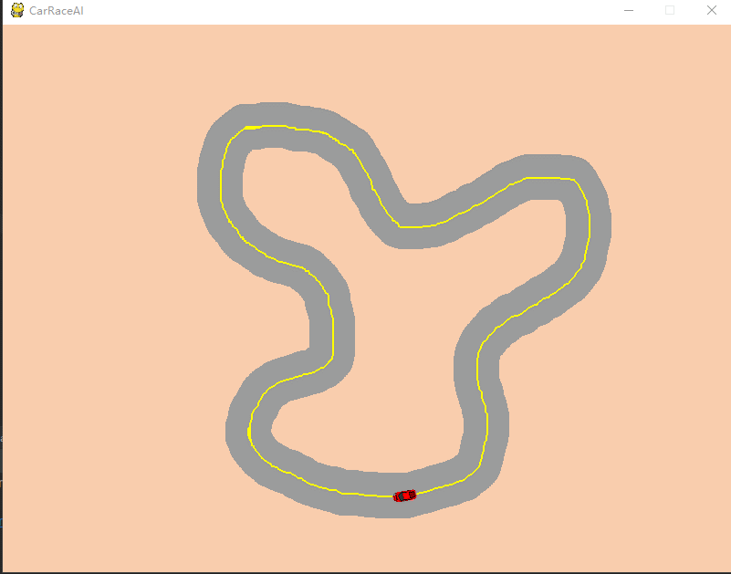

# CarRaceAI
仿真跑道和强化学习控制

# 环境说明

* pygame 1.9
* pytorch 1.1
* python 3.6.6
* TensorBoardX

# 功能展示

## 游戏模式 (方向键控制游戏)

## 绘图模式（自己绘制地图）

## AI模式
（目前没有训练好可以适应任何地图的AI）
圆形赛道跑通，附上测试图片

# 更新日志

* 2020.06.18：AI训练中，不需要当前角度这个信息，同时将回归问题划分为分类问题。（当前配置可以跑通圆形地图，提交做为记录）
* 2020.06.12：修复由于Normal函数造成的在反向传播时，引起的梯度为nan的bug。（不能在输出的时候clamp，否则log_prob容易出现极大值导致Nan）
* 2020.06.11：生成地图添加斑马线（用来训练AI时，计算到中心位置）
* 2020.06.10：添加训练代码
* 2020.06.09：添加测距线显示关闭开关
* 2020.06.09：环境函数增加5个方向的测距代码
* 2020.06.09：添加路径记录功能（用以小车生成时，初始化小车的位置）
* 2020.06.08：提交小车快跑游戏，具有撞壁死，加速，减速，拐弯，绘制地图等初步功能
* 2020.06.06：项目开始

# AI调参日志

* 2020.06.18：AC学习率均为0.0001，奖励函数设置死亡惩罚100，不死每步奖励0.5。（迭代550次，可跑通圆形赛道）
* 2020.06.15：把该问题当做回归问题，虽然网络输出比较简单（只有加速度，角速度两个参数），但是从输出可以看到，很明显，可以收敛，但是有点难。回归法放弃！！！

# 操作方法

## 模式切换

* 绘图模式：初始界面使用`p`键进入

* 游戏模式：程序开始默认为**游戏模式**，如果当前为**绘图模式**，使用`esc`键返回游戏模式

* AI模式：暂时没有实现（AI没有训练好）

## 绘图模式

* 鼠标：鼠标按下，开始移动可以绘图
* 按键`l`：路径跟踪开关，用以绘制斑马线，默认打开。在主线路绘制完成后，建议关闭路径跟踪功能。
* 按键`g`：用以生成地图，内部会进行图像心态学处理，去除噪声，同时生成斑马线。
* 按键`s`：保存地图，并且保存到`config/map`文件夹中

## 游戏模式

* 上下左右键：分别对应加速、减速、左拐、右拐功能；
* 按键`r`：记录轨迹开关，默认关闭。（轨迹用来在加载地图时，自动生成小车）
* 按键`s`：保存轨迹
* 按键`c`：清楚界面上的小车
* 按键`l`：显示测距信息
* 按键`n`：切换到下一张地图
* 按键`b`：切换到上一张地图
* 鼠标左键：在地图上没有小车时，点击地图赛道位置，会自动生成一个方向向上的小车

# 游戏文件说明

* CarMain.py：**主函数启动文件**，负责游戏内各种信号的转发，已经环境初始化
* CarGame.py：游戏模型对应的启动文件
* CarGameAI.py：AI模式使用的环境代码，里面设置有奖励函数、初始化环境等代码
* paintMap.py：绘图模式对应的启动文件
* TrainPPO.py：ppo训练启动代码

* AI：里面是强化学习，训练模型实现自动控制小车的相关功能
    * config：强化学习配置文件
    * model：训练好可以用的模型
    * net：神经网络结构
    * out：输出日志文件
    * Model.py：训练模型
    
* car：小车模型
    * CarAI.py：用于训练AI专用的小车模型
    * CarBase.py：小车基础模型，可以控制方向速度，以及输出自身状态等功能
    
* config：游戏配置文件
    * map：地图文件，主要是png图片，由绘图模式下生成的地图
    * mapjson：对应地图文件的的位置信息，用以初始化小车位置
    * png：小车logo，有红色和黄车两种小车
    * MapConfig.py：配置信息，界面名称，地图颜色，测距方向等参数
    
* map：地图相关代码
    * CarMap.py：用于加载地图，功能比较单一
    
* tools：工具函数存放位置
    * convert.py：转换类相关的函数放置在此
    * RacingTrack.py：保存路径，和加载跟踪路径

